A workshop project that pairs a **Sui Move** `BuilderCard` **package** with a **read-only Vite/React site**.

You publish and create your card with the **Sui CLI**, then set one object ID so the website can read on-chain profile data over **Sui GraphQL**.

There is **no browser wallet**, **no create form**, and **no on-page transaction signing**. Writes happen in the terminal only.

---

## Essential resources

| Resource                  | Link / path                                                                                                              |
| ------------------------- | ------------------------------------------------------------------------------------------------------------------------ |
| Node.js LTS               | [https://nodejs.org/](https://nodejs.org/)                                                                               |
| Sui CLI install           | [https://docs.sui.io/guides/developer/getting-started/sui-install](https://docs.sui.io/guides/developer/getting-started/sui-install) |
| Suiscan (Mainnet)         | [https://suiscan.xyz/mainnet](https://suiscan.xyz/mainnet)                                                               |
| Builder Registry (shared) | [https://github.com/Cryptita-Plays/cryptita-builder-registry](https://github.com/Cryptita-Plays/cryptita-builder-registry) |
| Upstream workshop repo    | [https://github.com/owenlim225/CRYPTITAPLAYS_BuilderWorkshop2026](https://github.com/owenlim225/CRYPTITAPLAYS_BuilderWorkshop2026) |
| QR code generator         | [https://www.qr-code-generator.com/solutions/text-qr-code/](https://www.qr-code-generator.com/solutions/text-qr-code/) |
| This repo layout          | `move/` (contract), `web/` (frontend), `spec/` (detailed specs)                                                          |
| Profile photo file        | `web/public/assets/profile.png`                                                                                          |
| Frontend env template     | `web/.env.example`                                                                                                       |

### Quick command cheat sheet

```bash
# Toolchain
sui --version
sui client active-env
sui client active-address
sui client balance

# Move
cd move
sui move build
sui move test
sui client publish --gas-budget 100000000

# Frontend
cd web
npm install
npm run dev
npm run lint
npm run build
npm run preview
```

---

## What you build

1. **Move package** (`move/`) — `builder_card` module with an owned `BuilderCard`, Display metadata, and `create_builder_card` (builder number claimed automatically from the shared registry).
2. **Static website** (`web/`) — single-viewport homepage that reads one on-chain object, shows your profile photo from `web/public/assets/profile.png`, and exports a card PNG client-side.

### How data flows

```text
1. Replace profile.png
2. Deploy website  →  get HTTPS URL
3. Publish Move package  →  Package ID
4. Call create_builder_card  →  Object ID  (+ auto builder_no from registry)
5. Set VITE_PORTFOLIO_OBJECT_ID in web/.env
6. Rebuild / redeploy site  →  card fills from chain; status dot turns green
```

---

## Prerequisites

1. Install [Node.js LTS](https://nodejs.org/).
2. Install [Sui CLI](https://docs.sui.io/guides/developer/getting-started/sui-install) (Move edition 2024).
3. Create a **Mainnet** Sui address and obtain SUI from workshop facilitators (see workshop path below).
4. Have a GitHub account and (for hosting) a Vercel account.

### Verify Sui CLI

```bash
sui --version
```

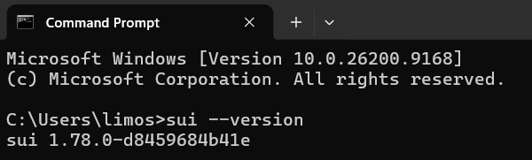

Expected: your installed Sui CLI version string (for example `sui 1.x.x`).

### Switch to Mainnet

```bash
sui client switch --env mainnet
```

If `mainnet` is missing:

```bash
sui client new-env --alias mainnet --rpc https://fullnode.mainnet.sui.io:443
sui client switch --env mainnet
```

Do **not** use Testnet for the workshop production path. Optional Testnet practice is listed at the end of this guide.

---

## Repository layout

```text
docs/     Contains image files used for this README
move/     Sui Move package (builder_card)
web/      Vite + React read-only frontend
spec/     Workshop specifications (aligned with this repo)
```

---

## Step-by-step workshop path

Follow these steps in order.

### Star and fork on GitHub

1. Open the upstream repo: [https://github.com/owenlim225/CRYPTITAPLAYS_BuilderWorkshop2026](https://github.com/owenlim225/CRYPTITAPLAYS_BuilderWorkshop2026)
2. Click **Star** on the upstream repo (yellow star = starred).

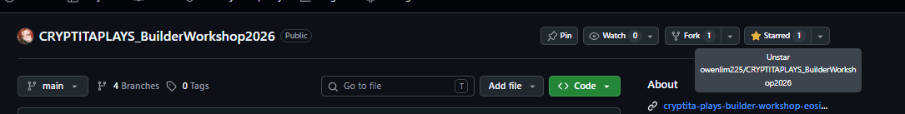

3. Click **Fork**.
   - **Owner:** your GitHub account
   - **Repository name:** `CRYPTITAPLAYS_BuilderWorkshop2026_LastName` (replace `LastName` with your surname, e.g. `CRYPTITAPLAYS_BuilderWorkshop2026_Lingao`)
   - Copy the **main** branch only
   - Click **Create fork**

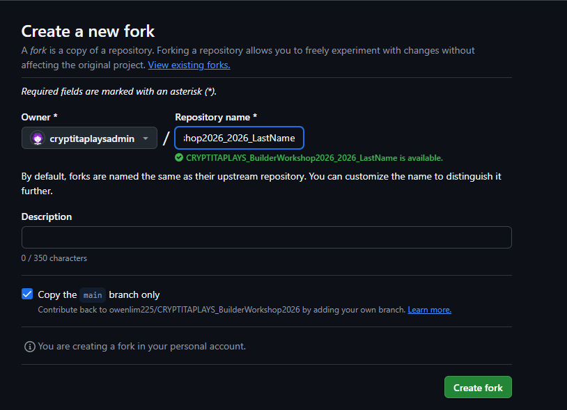

### Step 1 — Clone your fork, open VS Code, install frontend, get Mainnet SUI

1. Open a terminal.
2. Clone **your fork** (not the upstream repo), then open it in VS Code:

```bash
git clone https://github.com/YOUR_GITHUB_USERNAME/CRYPTITAPLAYS_BuilderWorkshop2026_LastName.git
cd CRYPTITAPLAYS_BuilderWorkshop2026_LastName
code .
```

On PowerShell:

```powershell
git clone https://github.com/YOUR_GITHUB_USERNAME/CRYPTITAPLAYS_BuilderWorkshop2026_LastName.git
cd CRYPTITAPLAYS_BuilderWorkshop2026_LastName
code .
```

3. In the project terminal, install the frontend and copy the env file:

```bash
cd web
npm install
cp .env.example .env
```

On PowerShell:

```powershell
cd web
npm install
Copy-Item .env.example .env
```

Leave `VITE_PORTFOLIO_OBJECT_ID` empty for now. `web/.env.example` already sets `VITE_SUI_NETWORK=mainnet`.

4. Confirm you are on Mainnet:

```bash
sui client active-env
sui client switch --env mainnet
```

5. If you do not have an address yet:

```bash
sui client new-address ed25519
sui client active-address
```

6. Copy your address (starts with `0x`).
7. Open [https://www.qr-code-generator.com/solutions/text-qr-code/](https://www.qr-code-generator.com/solutions/text-qr-code/) and paste your address to generate a QR code.
8. Show the QR code to a **technical facilitator** and ask for **Mainnet SUI** for gas. Do **not** use the Testnet faucet for workshop production.

9. Verify balance:

```bash
sui client balance
```

### Step 2 — Replace your profile photo

1. Replace `web/public/assets/profile.png` with your portrait.

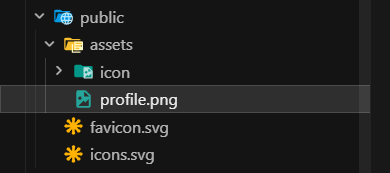

2. Keep the **exact filename** `profile.png`.
3. Prefer a square or portrait photo; it is cropped to the card frame.

### Step 3 — Run the site locally (empty card is OK)

```bash
cd web
npm run dev
```

Open [http://localhost:5173](http://localhost:5173)

Expected:

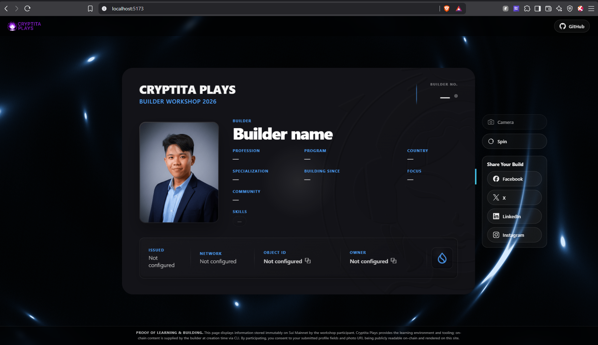

- Card shows placeholders (`—` / `Builder name`)
- Status dot next to BUILDER NO. is **grey**
- Photo still shows `profile.png` from local assets

### Step 4 — Deploy the website and copy your URL

Deploy `web/` first so you have a public HTTPS URL for the on-chain `website_url` argument.

**Vercel settings:**

| Setting                 | Value                                          |
| ----------------------- | ---------------------------------------------- |
| Root directory          | `web`                                          |
| Build command           | `npm run build`                                |
| Output directory        | `dist`                                         |
| Env (optional at first) | `VITE_SUI_NETWORK`, `VITE_PORTFOLIO_OBJECT_ID` |

1. Go to [https://vercel.com/new](https://vercel.com/new).
2. Click **Continue with GitHub**.

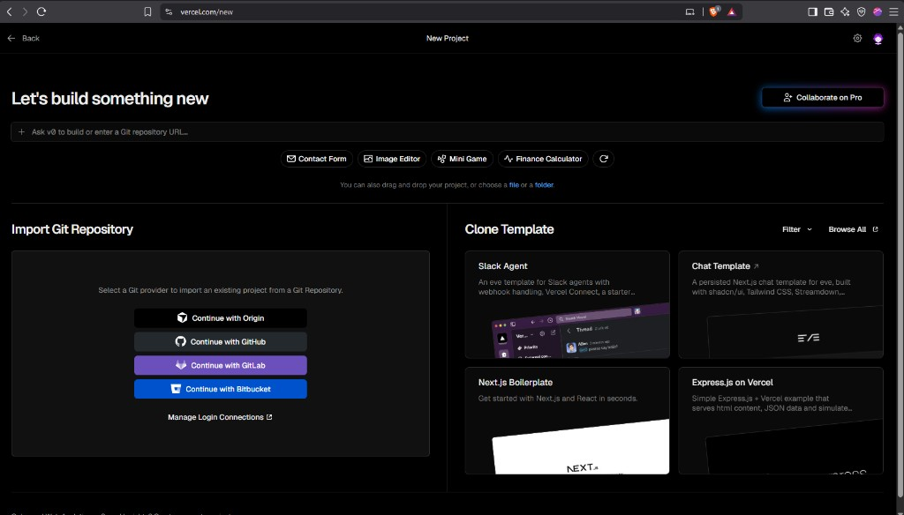

3. **Import** your forked repo (`CRYPTITAPLAYS_BuilderWorkshop2026_LastName`).

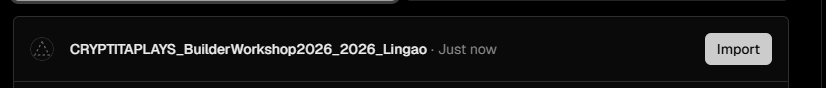

4. Open **Root Directory**, select `web`, then **Continue**.

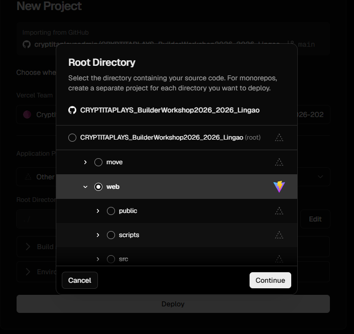

5. Click **Deploy**.
6. When deployment finishes, click **Continue to Dashboard**.

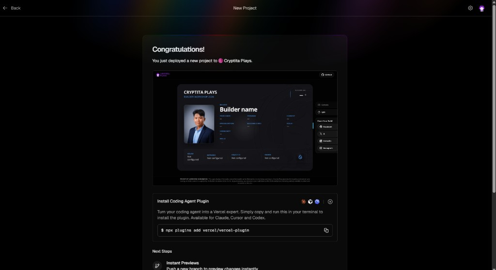

7. In the project sidebar, open **Settings → Environment Variables**.

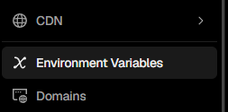

8. Click **Add Environment Variable**, then **Import .env** and choose your local `web/.env` file. Click **Save**.

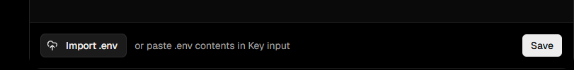

9. Confirm keys include `VITE_SUI_NETWORK=mainnet`. Set `VITE_PORTFOLIO_OBJECT_ID` empty until Step 8.

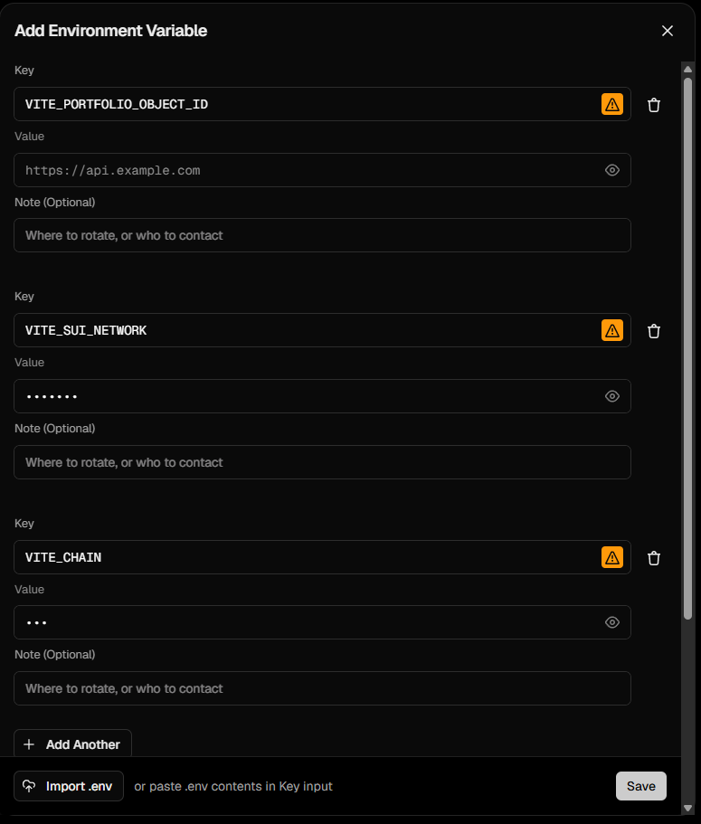

> **Warning:** Do not copy dummy placeholder values from the screenshot. Import your real `web/.env` from your machine.

10. Copy your site URL, e.g. `https://your-name.vercel.app` (no trailing slash). You need this for `create_builder_card` in Step 7.

### Step 5 — Build and test the Move package

```bash
cd move
sui move build
sui move test
```

**Linux / macOS — `Move.lock` directory error**

If `sui move build` fails because `Move.lock` is a directory:

```bash
cd move
rm Move.lock
sui move build
```

### Step 6 — Publish the package on Mainnet

```bash
sui client switch --env mainnet
sui client active-address         # must be funded with Mainnet SUI
cd move
sui client publish --gas-budget 100000000
```

1. From the publish output, copy the **Package ID** (`Published Objects` / package digest).
2. Save it somewhere safe. You need it for `--package` in the next step.

### Step 7 — Create your BuilderCard

`builder_no` is **not** a CLI argument. It is claimed automatically from the shared Cryptita Builder Registry. Never pass `builder_no`.

Pass the **shared registry object** first, then **12 strings** in this exact order:

| #   | Argument                                   | Example                                     | You change? |
| --- | ------------------------------------------ | ------------------------------------------- | ----------- |
| 1   | `registry` (shared object ID)              | Mainnet ID below                            | **No** — copy as-is |
| 2   | `builder_name`                             | `"Alex Rivera"`                             | **Yes** |
| 3   | `profession`                               | `"Smart Contract Developer"`                | **Yes** |
| 4   | `program`                                  | `"Cryptita Build & Deploy 2026"`            | **Yes** |
| 5   | `country`                                  | `"Philippines"`                             | **Yes** |
| 6   | `specialization`                           | `"DeFi Protocols"`                          | **Yes** |
| 7   | `building_since`                           | `"2024"`                                    | **Yes** |
| 8   | `focus`                                    | `"Move on Sui"`                             | **Yes** |
| 9   | `community`                                | `"Cryptita Plays"`                          | **Yes** |
| 10  | `skills` (comma-separated)                 | `"Move, Sui, TypeScript, React"`            | **Yes** |
| 11  | `issued`                                   | `"August 2026"`                             | **No** — copy as-is |
| 12  | `about` (on-chain only; not shown on site) | `"Workshop participant learning Sui Move."` | **Yes** |
| 13  | `website_url` (no trailing slash)          | `"https://your-name.vercel.app"`            | **Yes** — your Step 4 URL |

**Mainnet registry object ID (workshop production):**

`0x297cb610c0c47edc1e12008812f28cd8a1f35f95bb406d45f4b76fa9fda2e04c`

On create, the contract also stores:

- `builder_no` — claimed automatically from the registry (`u64`)
- `website_url` — shown as Suiscan / Display `link`
- `photo_url` — derived as `{website_url}/assets/profile.png` for explorers

Package `init` also creates **Display** metadata so Suiscan can show a human name, image, and site link.

Personalize only these **11 fields**: `builder_name`, `profession`, `program`, `country`, `specialization`, `building_since`, `focus`, `community`, `skills`, `about`, `website_url`. Copy the Mainnet registry ID and `issued` (`August 2026`) exactly as shown.

#### Bash / macOS / Git Bash

```bash
sui client call \
  --package 0xPACKAGE_ID \
  --module builder_card \
  --function create_builder_card \
  --args \
    0x297cb610c0c47edc1e12008812f28cd8a1f35f95bb406d45f4b76fa9fda2e04c \
    "Alex Rivera" \
    "Smart Contract Developer" \
    "Cryptita Build & Deploy 2026" \
    "Philippines" \
    "DeFi Protocols" \
    "2024" \
    "Move on Sui" \
    "Cryptita Plays" \
    "Move, Sui, TypeScript, React" \
    "August 2026" \
    "Workshop participant learning Sui Move." \
    "https://your-name.vercel.app" \
  --gas-budget 10000000
```

Replace `0xPACKAGE_ID` with your publish output. Personalize only the fields marked **Yes** in the table above.

#### PowerShell

```powershell
sui client call `
  --package 0xPACKAGE_ID `
  --module builder_card `
  --function create_builder_card `
  --args `
    0x297cb610c0c47edc1e12008812f28cd8a1f35f95bb406d45f4b76fa9fda2e04c `
    "Alex Rivera" `
    "Smart Contract Developer" `
    "Cryptita Build & Deploy 2026" `
    "Philippines" `
    "DeFi Protocols" `
    "2024" `
    "Move on Sui" `
    "Cryptita Plays" `
    "Move, Sui, TypeScript, React" `
    "August 2026" `
    "Workshop participant learning Sui Move." `
    "https://your-name.vercel.app" `
  --gas-budget 10000000
```

1. From the call output, copy the **Created Object ID** of the new `BuilderCard`.
2. Open Suiscan to verify fields and link:
   - Mainnet: `https://suiscan.xyz/mainnet/object/0xYOUR_OBJECT_ID/fields`

### Step 8 — Point the frontend at your object

Edit `web/.env`:

```env
VITE_PORTFOLIO_OBJECT_ID=0xYOUR_OBJECT_ID
VITE_SUI_NETWORK=mainnet
VITE_CHAIN=sui
```

Update the same values in Vercel **Environment Variables**, then **Redeploy**.

### Step 9 — Rebuild and verify

Locally:

```bash
cd web
npm run build
npm run preview
```

Or set the same env vars in Vercel and **Redeploy**.

Expected:

1. Card fields fill from chain (name, profession, skills, issued, …).
2. Status dot turns **green**.
3. OBJECT ID / OWNER / NETWORK rows populate.
4. Photo still comes from `/assets/profile.png` on your deployed site.
5. Suiscan shows your `website_url` link and explorer image URL.

### Step 10 — Optional: replace or reset the displayed card

**Show a different card:** call `create_builder_card` again, update `VITE_PORTFOLIO_OBJECT_ID`, rebuild/redeploy. Old objects stay on-chain.

**Reset local / template for other users (later):**

1. Clear `VITE_PORTFOLIO_OBJECT_ID=` in `web/.env` (and in Vercel).
2. Keep `web/.env.example` empty for that value.
3. Do not commit personal `.env` values.
4. `move/build/` is gitignored and safe to delete; regenerate with `sui move build`.
5. On-chain history cannot be deleted — “reset” means pointing the site at an empty or new object ID.

---

## Package ID vs Object ID

| ID                     | When you get it               | Used for                                   |
| ---------------------- | ----------------------------- | ------------------------------------------ |
| **Package ID**         | `sui client publish`          | CLI `--package` for `create_builder_card`  |
| **Registry object ID** | Shared Cryptita registry      | First CLI arg (`&mut BuilderRegistry`)     |
| **Object ID**          | `create_builder_card` success | `VITE_PORTFOLIO_OBJECT_ID` in the frontend |

The website reads the **created BuilderCard object**, not the package.

---

## Environment variables

| Variable                   | Purpose                                                                       |
| -------------------------- | ----------------------------------------------------------------------------- |
| `VITE_PORTFOLIO_OBJECT_ID` | Created BuilderCard object ID. Empty = placeholder card + grey status dot     |
| `VITE_SUI_NETWORK`         | `mainnet` for workshop production — selects GraphQL endpoint and NETWORK label |
| `VITE_CHAIN`               | Visual chain theme (default `sui`)                                            |

Vite inlines `VITE_*` at **build time**. After any `.env` change, rebuild and redeploy.

---

## Troubleshooting

### Sui CLI / gas

| Error / symptom           | Likely cause                                               | Fix                                                              |
| ------------------------- | ---------------------------------------------------------- | ---------------------------------------------------------------- |
| `sui: command not found`  | CLI not installed or not on PATH                           | Reinstall from official docs; reopen terminal                  |
| No gas / cannot find coin | SUI is in address balance, not a coin object               | Fund address; follow current Sui docs to convert balance → coin  |
| Wrong network publish     | Active env is not mainnet                                  | `sui client switch --env mainnet` then republish                 |
| Insufficient gas budget   | Budget too low                                             | Raise `--gas-budget` (e.g. `100000000` publish, `10000000` call) |

### Publish / create

| Error / symptom                             | Likely cause                                               | Fix                                                                       |
| ------------------------------------------- | ---------------------------------------------------------- | ------------------------------------------------------------------------- |
| Compile error in Move                       | Dependency / syntax issue                                  | Run `sui move build` and fix reported lines first                         |
| `Move.lock` is a directory (Linux/macOS)    | Corrupt lock path                                          | `cd move && rm Move.lock && sui move build`                               |
| `create_builder_card` arity / type mismatch | Wrong number or order of args                              | Use registry object + 12 strings; do **not** pass `builder_no`            |
| Registry object not found / wrong type      | Wrong network registry ID                                  | Use the Mainnet ID on mainnet (see Step 7)                                |
| Object created but Suiscan shows no link    | Forgot `website_url` or used trailing slash inconsistently | Pass clean HTTPS URL with no trailing slash; recreate card if needed      |
| Old object missing `website_url`            | Object created with previous schema                        | Republish package and create a **new** card                               |

### Frontend

| Error / symptom                     | Likely cause                                    | Fix                                                          |
| ----------------------------------- | ----------------------------------------------- | ------------------------------------------------------------ |
| Card stays empty / grey dot         | `VITE_PORTFOLIO_OBJECT_ID` empty or not rebuilt | Set object ID in `.env`, then restart `npm run dev` or rebuild |
| Card error / “object not found”     | Wrong ID, wrong network, or typo                | Match `VITE_SUI_NETWORK=mainnet` to where the object exists  |
| Env change ignored                  | Vite caches build-time env                      | Stop/restart `npm run dev`; for production, rebuild + redeploy |
| Photo missing                       | File not at `web/public/assets/profile.png`     | Replace that exact path/filename and redeploy                |
| Photo OK locally, broken on Suiscan | Site not deployed or wrong `website_url`        | Deploy site first; pass that URL as last create arg          |
| Dot green but fields empty/error    | Object ID set but fetch failed                  | Check network, object type ends with `::builder_card::BuilderCard` |

### Reset / handoff

| Goal                                | What to do                                                                             |
| ----------------------------------- | -------------------------------------------------------------------------------------- |
| Clear personal data from local site | Empty `VITE_PORTFOLIO_OBJECT_ID` in `web/.env`, restart dev server                     |
| Prepare repo for next cohort        | Keep `.env.example` empty for that value; never commit `.env`                          |
| Clear hosted site                   | Clear Vercel env vars → Redeploy                                                       |
| Delete on-chain data                | Not possible — create a new object and point the site at it                            |

---

## Optional Testnet practice

Use this only if you want extra practice **before** Mainnet workshop production:

1. `sui client switch --env testnet` and fund via [https://faucet.sui.io/](https://faucet.sui.io/)
2. Practice publish + create on Testnet.
3. Testnet registry ID: `0x2995095d1e6fda52afde3649a74be5fc2b1dc8b57bfc9f60d5ff708afdcdc923`
4. Set `VITE_SUI_NETWORK=testnet` so the frontend GraphQL client matches.
5. Suiscan Testnet: [https://suiscan.xyz/testnet](https://suiscan.xyz/testnet)
6. When ready for workshop production, switch to Mainnet, republish, recreate, set `VITE_SUI_NETWORK=mainnet`, update env, and redeploy.

---

## License

Workshop educational use. Cryptita Plays branding and partner assets belong to their respective owners.
